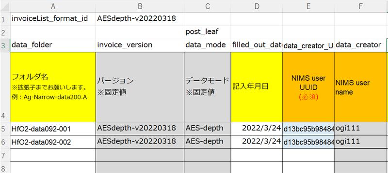
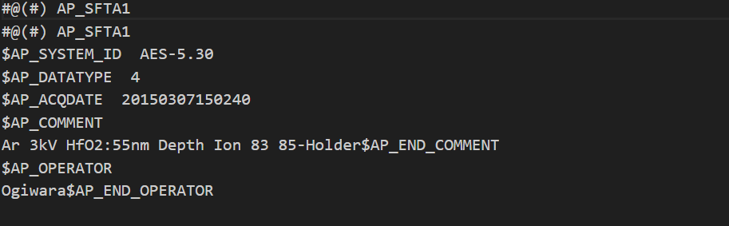
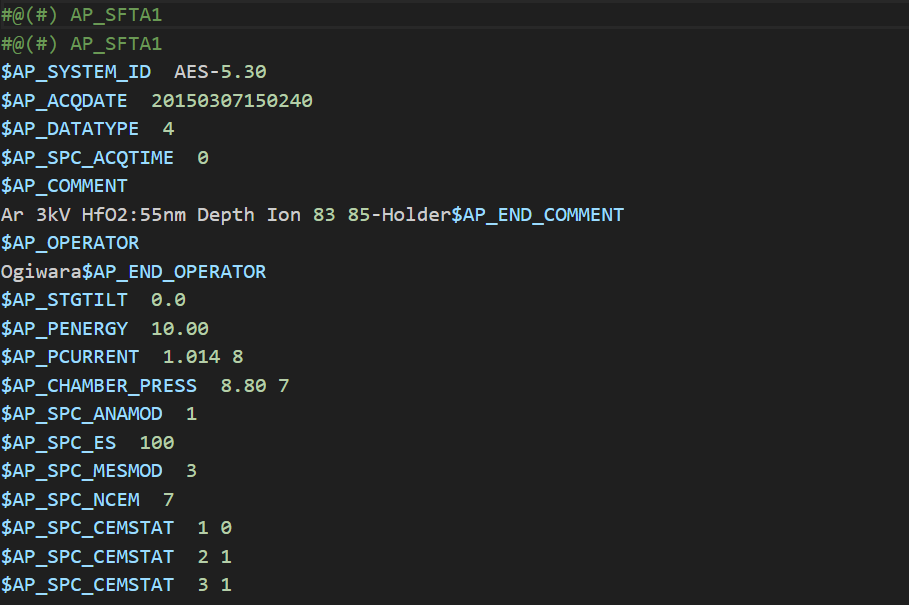
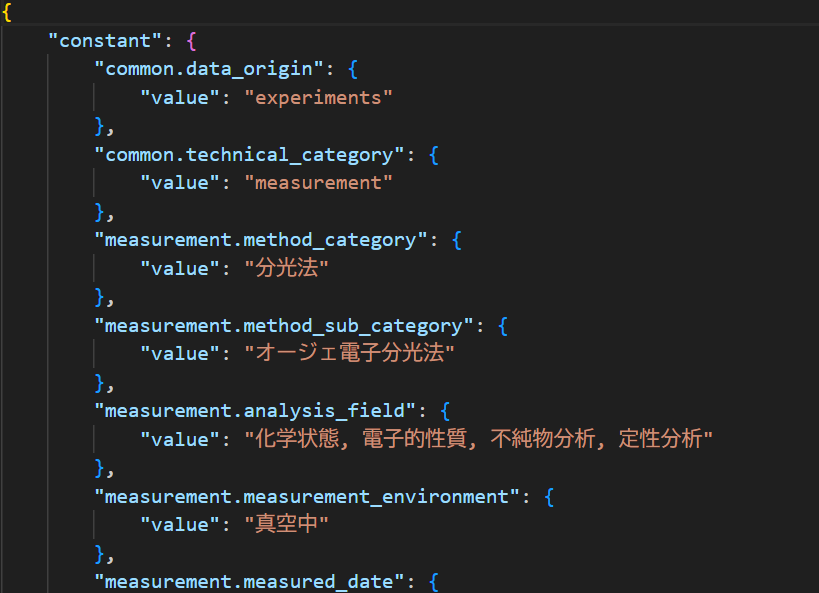
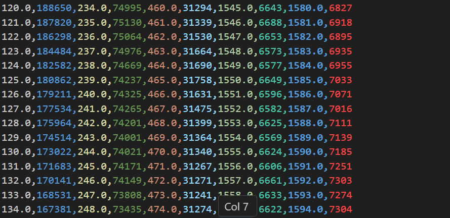
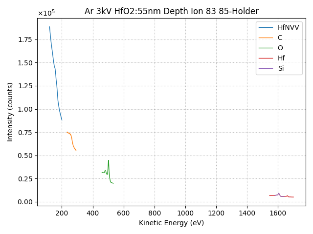
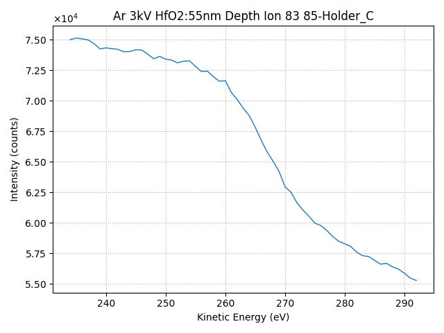

# AESデータセットテンプレート

## 概要

JEOL製オージェ電子分光装置（AES）JAMP-9500Fで取得された測定データの種類である、AESスペクトル（survey）と深さ方向測定スペクトル（depth）に対応したテンプレートです。
オージェ電子分光装置（AES）の測定データファイルおよびパラメータファイルを読み込み、データを可読化し、オージェ電子検出強度の可視化を行います。
データ登録方式として、エクセルインボイスおよびインボイスモードに対応しています。
## カタログ番号

本テンプレートには、測定データの違いによって以下のバリエーションが提供されています。
- DT0018
    - AES-survey
- DT0019
    - AES-depth

## 登録できるデータ

本データセットテンプレートで作成したデータセットには、'データファイル'と'構造化ファイル'と'メタ情報'を登録することができます。なお、データファイルは１つ登録する必要があります。

### 登録ファイル

以下は本データセットテンプレートに登録可能なファイルの一覧です。

|種類|命名規則|説明|
|:----|:----|:----|
|id,para,dataを含んだフォルダ|なし|AES(もしくは付属ソフトウェア)が出力するデータファイル|

- 登録ファイルの中身 (以下、例)
  - *_excel_invoice.xlsx (エクセルインボイスファイル)  
      
  - HfO2-data092-001.A (下記の３つの出力データの情報を含むフォルダ)
    - `id`：生データ（測定パラメータ） txt形式  
      - フォルダを規定する10件程度のパラメータが記述されている.  
      

    - `para`：生データ（測定パラメータ） txt形式  
      - 測定パラメータが記述されている.  
      

    - `data`：生データ（数値データ）　binary形式  
      - 計測データがバイナリー形式で保存されている.

### 出力ファイル

| ファイル名   | 内容   | 備考|
| :------------------- | :------------ | :--------------- |
| `id`  |  nonshared_rawデータファイル  | 生データ（測定パラメータ） txt形式 |
| `para`| nonshared_rawデータファイル| 生データ（測定パラメータ） txt形式|
| `data`| nonshared_rawデータファイル|  生データ（数値データ）　binary形式|
| `metadata.json`   | 主要パラメータメタ情報ファイル |    |
| `id.csv`|  スペクトルデータファイル   | |
| `id.png`| スペクトルグラフ代表画像ファイル |    |
| `id_*.png` | 元素別スペクトルグラフ画像 |<br>（例：C元素のスペクトル） <br>元素ごとにオージェスペクトル画像を個別に複数出力 |


### メタ情報

次のように、大きく4つに分類されます。

- 基本情報
- 固有情報
- 試料情報
- 抽出メタ情報

#### 基本情報

基本情報はすべてのデータセットテンプレート共通のメタです。詳細は[データセット閲覧 RDE Dataset Viewer > マニュアル](https://dice.nims.go.jp/services/RDE/RDE_manual.pdf)を参照してください。

#### 固有情報

固有情報はデータセットテンプレート特有のメタです。以下は本データセットテンプレートに設定されている固有メタ情報項目です。

| 項目名|必須 | 日本語名| 英語名  | データ型 | 単位 |備考|
| ---------------------------------------| ----- | ------------------ | ---------------------------------------- | ------ | -- | -- |
| analyser_detection_solid_angle  |  | 分光器への信号取込み立体角  | Analyser detection solid angle   | string | sr ||
| analyser_transmission_function  |   | 分光器の透過関数   | Analyser transmission function   | string |||
| analyser_type   || 分光器の型  | Analyser type| string |||
| frr_crr_analyser_energy_resolution   || FRR/CRRエネルギー分解能の値  | FRR/CRR Analyser energy resolution   | string | %  ||
| fat_cae_analyser_energy_resolution   || FAT/CAEエネルギー分解能の値  | FAT/CAE Analyser energy resolution   | string | eV ||
| energy_resolution_from_obtained_spectrum || 取得スペクトルからのエネルギー分解能 | Energy resolution from obtained spectrum | string | eV ||
| measurement_method  |o| 測定方法   | Measurement method   | string |||
| measurement_condition |o| 測定条件   | Measurement condition| string ||AES-depthのみ|

#### 試料情報

試料情報は試料に関するメタで、試料マスタ（[データセット閲覧 RDE Dataset Viewer > マニュアル](https://dice.nims.go.jp/services/RDE/RDE_manual.pdf)参照）と連携しています。以下は本データセットテンプレートに設定されている試料メタ情報項目です。

|項目名|必須|日本語名|英語名|単位|初期値|データ型|フォーマット|備考|
|:----|:----|:----|:----|:----|:----|:----|:----|:----|
|sample_name_(local_id)|o|試料名(ローカルID)|Sample name (Local ID)|||string|||
|chemical_formula_etc.||化学式・組成式・分子式など|Chemical formula etc.|||string|||
|administrator_(affiliation)|o|試料管理者(所属)|Administrator (Affiliation)|||string|||
|reference_url||参考URL|Reference URL|||string|||
|related_samples||関連試料|Related samples|||string|||
|tags||タグ|Tags|||string|||
|description||試料の説明|Description |||string|||
|sample.general.general_name||一般名称|General name|||string|||
|sample.general.cas_number||CAS番号|CAS Number|||string|||
|sample.general.crystal_structure||結晶構造|Crystal structure|||string|||
|sample.general.sample_shape||試料形状|Sample shape|||string|||
|sample.general.purchase_date||試料購入日|Purchase date|||string|||
|sample.general.supplier||購入元|Supplier|||string|||
|sample.general.lot_number_or_product_number_etc||ロット番号、製造番号など|Lot number or product number etc|||string|||

#### 抽出メタ

抽出メタ情報は、データファイルから構造化処理で抽出したメタデータです。以下は本データセットテンプレートに設定されている抽出メタ情報項目です。入力フォーマット別に表示します。

---

| 項目名   |取得元| 日本語名  | 英語名| データ型| 単位  | 初期値(depth)  |初期値(survey)  |備考|
| ------------------------ | ----- | ------------------------- | ---------------------------------- | ------- | --- | ----------------- | --- | --- |
| common.data_origin|default_value.csvから取得| データの起源| Data Origin  | string  | |  experiments |experiments||
| common.technical_category | default_value.csvから取得| 技術カテゴリー   | Technical Category   | string  | |  measurement |measurement||
| measurement.method_category|default_value.csvから取得| 計測法カテゴリー  | Method category  | string  | |  分光法 |分光法||
| measurement.method_sub_category   |default_value.csvから取得 | 計測法サブカテゴリー| Method sub-category  | string  | | オージェ電子分光法  |オージェ電子分光法||
| measurement.analysis_field |default_value.csvから取得 | 分析分野  | Analysis field   | string  | | 化学状態, 電子的性質, 不純物分析, 定性分析 |定性分析, 定量分析||
| measurement.specimen|default_value.csvから取得| 試料| Specimen | string  | |   |||
| measurement.measurement_environment|default_value.csvから取得| 測定環境  | Measurement environment  | string  | | 真空中  |真空中||
| measurement.energy_level_transition_structure_etc_of_interest | default_value.csvから取得 | 対象準位_遷移_構造  | Energy Level_Transition_Structure etc. of interest | string  | |   |||
| measurement.measured_date | default_value.csvから取得 | 分析年月日 | Measured date| string  | | ||format: date|
| measurement.standardized_procedure_specified_number |  default_value.csvから取得 | 標準手順  | Standardized procedure   | string  | |   |||
| measurement.instrumentation_site  | default_value.csvから取得  | 装置設置場所| Instrumentation site | string  | |   |||
| measurement.reference  |  default_value.csvから取得 | 参考文献  | Reference| string  | |   |||
| operator_identifier|AP_OPERATOR | 測定者   | Operator identifier  | string  | | |||
| operation_date_time_year| AP_ACQDATE| 測定日時[年]  | Operation Date-time[Year]   | integer | |  |||
| operation_date_time_month|AP_ACQDATE| 測定日時[月]  | Operation Date-time[Month]  | integer | |  |||
| operation_date_time_day |AP_ACQDATE| 測定日時[日]  | Operation Date-time[Day]| integer | |  |||
| operation_date_time_hour |AP_ACQDATE| 測定日時[時]  | Operation Date-time[Hour]   | integer | |  |||
| operation_date_time_minute   |AP_ACQDATE| 測定日時[分]  | Operation Date-time[Minute] | integer | |  |||
| operation_date_time_second  | AP_ACQDATE| 測定日時[秒]  | Operation Date-time[Second] | integer | |  |||
| probe_energy   |AP_PENERGY| プローブエネルギー | Probe energy | string  | keV |   |||
| probe_current |AP_PCURRENT | プローブ電流| Probe current| string  | A   | |||
| analyzer_mode |AP_SPC_ANAMOD | 分析器分光動作モード| Analyzer Mode| string  | |  |||
| analyser_pass_energy  |AP_SPC_ES| 分光器のパスエネルギー   | Analyser pass energy | string  | eV  |  |||
| species_label_transitions| AP_SPC_ROI_NAME| スペクトルの元素種と遷移  | Species label &Transitions  | string  | |  ||複数出力項目|
| abscissa_start |WIDEの場合はAP_SPC_WSTARTから取得。NARROWの場合はAP_SPC_ROI_STARTから取得| 横軸の起点 | Abscissa start   | string  | eV  |  ||複数出力項目|
| abscissa_end  |WIDEの場合はAP_SPC_WSTOPから取得。NARROWの場合はAP_SPC_ROI_STOPから取得。 | 横軸の終点 | Abscissa end   | string  | eV  |  ||複数出力項目|
| abscissa_increment|WIDEの場合はAP_SPC_WSTEPから取得。NARROWの場合はAP_SPC_ROI_STEPから取得。 | エネルギーステップ幅| Abscissa increment   | string  | eV  | ||複数出力項目|
| collection_time   | WIDEの場合はAP_SPC_WDWELLから取得。NARROWの場合はAP_SPC_ROI_DWELLから取得。 | シグナル収集時間（データ1点当たりの溜め込み時間） | Collection time  | string  | ms  |  ||複数出力項目|
| total_acquisition_number | WIDEの場合はAP_SPC_WSWEEPSから取得。NARROWの場合はAP_SPC_ROI_SWEEPSから取得。 | 総積算回数 | Total Acquisition Number | string  | |||複数出力項目|
| probe_scan_mode  |AP_SPOSN_BSMOD  | 入射プローブの走査方法   | Probe scan mode  | string  | | |||
| probe_diameter|AP_SPOSN_PDIA | 入射プローブのビーム直径  | Probe diameter   | string  | um  | |||
| upper_left_x_coordinate | AP_SPOSN_BEAM_P1X | 分析領域の左上座標X| Upper left x coordinate  | string  | |  |||
| upper_left_y_coordinate | AP_SPOSN_BEAM_P1Y | 分析領域の左上座標Y| Upper left y coordinate  | string  | | |||
| lower_right_x_coordinate|AP_SPOSN_BEAM_P2X | 分析領域の右下座標X| Lower right x coordinate | string  | | |||
| lower_right_y_coordinate| AP_SPOSN_BEAM_P2Y| 分析領域の右下座標Y| Lower right y coordinate | string  | |  |||
| probe_polar_angle_to_sample_normal| AP_STGTILT | 入射プローブの入射角| Probe polar angle to sample normal   | string  | deg |  |||
| comment|AP_COMMENT| コメント  | Comment  | string  | | |||
| neutralization_active_mode   | AP_IGN_NEUT_MODE | 中和実行の有無   | Neutralization active mode   | string  | | |||
| data_type  |AP_DATATYPE| データの種類| Data type| string  | | |||
| analysis_chamber_pressure_when_measurement_finished|AP_CHAMBER_PRESS  | 分析終了時の分析室の真空度 | Analysis chamber pressure when measurement finished  | string  | Pa  |   |||


## データカタログ項目


データカタログの項目です。データカタログはデータセット管理者がデータセットの内容を第三者に説明するためのスペースです。

|RDE2.0用パラメータ名|日本語名|英語名|データ型|備考|
|:----|:----|:----|:----|:----|
|catalog|データカタログ|Data Catalog|object||
|dataset_title|データセット名|Dataset Title|string||
|abstract|概要|Abstract|string||
|data_creator|作成者|Data Creator|string||
|language|言語|Language|string||
|experimental_apparatus|使用装置|Experimental Apparatus|string||
|data_distribution|データの再配布|Data Distribution|string||
|raw_data_type|データの種類|Raw Data Type|string||
|raw_data_size|格納データ|Stored Data|string||
|remarks|備考|Remarks|string||
|references|参考論文|References|string||
|key1|キー1|key1|string|汎用項目
|key2|キー2|key2|string|汎用項目
|key3|キー3|key3|string|汎用項目
|key4|キー4|key4|string|汎用項目
|key5|キー5|key5|string|汎用項目

## 構造化処理の詳細

### 設定ファイルの説明

構造化処理を行う際の、設定ファイル(`rdeconfig.yaml`)の項目についての説明です。

| 階層 | 項目名 | 語彙 | データ型 | 標準設定値 | 備考 |
|:----|:----|:----|:----|:----|:----|
| system | save_raw | 入力ファイル公開・非公開  | string | false | 公開したい場合は'true'に設定。 |
| system | save_thumbnail_image | サムネイル画像保存  | string | 'true' | |


### dataset関数の説明

AESが出力するデータを使用した構造化処理を行います。以下関数内で行っている処理の説明です。

```python
def dataset(
    srcpaths: RdeInputDirPaths, resource_paths: RdeOutputResourcePath,
) -> None:
    """Process structured text files, extract metadata, and generate visualizations.

    Handles structured text parsing, metadata extraction, CSV generation, and graph creation.
    Additional processing steps can be implemented depending on project needs.

    Args:
        srcpaths (RdeInputDirPaths): Paths to input resources for processing.
        resource_paths (RdeOutputResourcePath): Paths to output resources for saving results.

    Returns:
        None

    Note:
        The actual function names and processing details may vary depending on the project.

    """
```
### 構造化ファイルのパスを作成
- 元ファイル名を基に関連ファイルのパスを抽出・生成し、不足ファイルがあれば例外を投げる処理。
```python
    rawfiles = resource_paths.rawfiles

    # Initialization
    raw_file_path_id = raw_file_path_para = raw_file_path_data = csv_file_path = None

    for path in rawfiles:
        if path.name == "id":
            raw_file_path_id = path
            csv_file_path = resource_paths.struct.joinpath(f"{raw_file_path_id.name}.csv")
        elif path.name == "para":
            raw_file_path_para = path
        elif path.name == "data":
            raw_file_path_data = path

    if raw_file_path_para is None or raw_file_path_data is None or csv_file_path is None:
        error_msg = "Missing required input files in resource_paths.rawfiles."
        raise ValueError(error_msg)

    metadata_def_path = srcpaths.tasksupport.joinpath("metadata-def.json")
    default_val_path = srcpaths.tasksupport.joinpath("default_value.csv")
```

### インスタンスの作成

- ファイル読み込み、メタデータ解析、グラフ描画、データ処理をまとめるコーディネーターインスタンスを作成しています。
```python
    module = AESProcessingCoordinator(
        FileReader(),
        MetaParser(
            metadata_def_json_path=metadata_def_path,
            meta_default_vals_file_path=default_val_path,
        ),
        GraphPlotter(),
        StructuredDataProcesser(),
    )
```

#### ファイルの読み込み
- パラメータファイル (raw_file_path_para) を読み込み、ヘッダー情報 (dct_hdr) とデータモード (data_mode) を取得しています。
- パラメータファイルから得たヘッダー情報とデータモードを用いてデータオブジェクト (data_obj) を生成しています。
```python
    # Read Input File
    dct_hdr = data_mode = None
    dct_hdr, data_mode = module.file_reader.read_para_file(raw_file_path_para)

    if data_mode is None:
        error_msg = "data_mode is None. 'read_para_file' did not return a valid mode."
        raise ValueError(error_msg)

    data_obj = module.file_reader.read_data_spe_file(raw_file_path_data, data_mode, dct_hdr)
```

#### CSVファイルへの保存
- 計測データを、data_mode に応じて構造化データ処理クラス(structured_processer)の適切なメソッドで加工し、CSVファイルに保存しています。

```python
        # Save csv
        # Modified processing due to modularization
    if data_mode == "AES-survey":
        module.structured_processer.write_fnd_csv_file_survey(
            csv_file_path, dct_hdr, data_obj,
        )
    elif data_mode == "AES-narrow":
        module.structured_processer.write_fnd_csv_file_narrow(
            csv_file_path, dct_hdr, data_obj,
        )
```

#### メタデータの解析と保存
- resource_paths.meta のディレクトリのパスにmetadata.jsonを保存する

```python
    # メタデータ保存
    const_meta_info, repeated_meta_info = module.meta_parser.parse(dct_hdr, data_mode)
    module.meta_parser.save_meta(
        resource_paths.meta.joinpath("metadata.json"),
        Meta(metadata_def_path),
        const_meta_info=const_meta_info,
        repeated_meta_info=repeated_meta_info,
    )
```

#### 計測データの可視化
- プロットを生成するためのメソッドを呼び出す
- 生成されたグラフを 代表画像ファイル(resource_paths.main_image) 、画像ファイル (resource_paths.other_image)  に保存する

```python
        # Graph
    module.graph_plotter.plot_corrected_original(
        csv_file_path,
        resource_paths.main_image,
        resource_paths.other_image,
    )
```